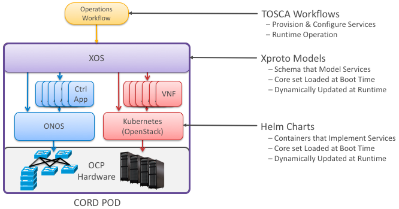

# End-to-End Example

This section gives a brief overview of lifecycle management in CORD,
illustrating the role XOS plays in operationalizing a system built from
a collection of disaggregated services. 

As depicted in this diagram, CORD adopts a three-layer approach:

* **Installation (Helm):** Installing CORD means installing a collection
  of Docker containers in a Kubernetes cluster. CORD uses Helm to carry
  out the installation, with the valid configurations defined by a set of
  `helm-charts`. These charts specify the version of each container to be
  deployed, and so they also play a role in upgrading a running system.

* **Operations (TOSCA):** A running CORD POD supports multiple Northbound
  Interfaces (e.g., a GUI and REST API), but CORD typically uses `TOSCA` to specify
  a workflow for configuring and provisioning a running system. A freshly
  installed CORD POD has a set of control plane and platform level containers
  running (e.g., XOS, ONOS, OpenStack), but until provisioned using `TOSCA`,
  there are no services and no service graph.

* **Integration (XOS):** The services running in an operational system
  are typically deployed as Docker containers, paired with a model that
  specifies how the service is to be integrated into CORD. This model is
  writen in the `xproto` modeling language, and processed by the XOS
  tool-chain. Among other things, this tool-chain generates the
  TOSCA-engine that is used to process the configuration and provisioning
  workflows used to operate CORD.

These tools and containers are inter-related as follows:

* An initial install brings up a set of XOS-related containers (e.g., `xos-core`,
  `xos-gui`, `xos-tosca`) that have been configured with a base set of models.
  Of these, the `xos-tosca` container implements the TOSCA engine, which
  takes TOSCA workflows as input and configures/provisions CORD accordingly.

* While the install and operate stages are distinct, for convenience,
  some helm-charts elect to launch a `tosca-loader` container
  (in Kubernetes parlance, it's a *job* and not a *service*) to load an initial
  TOSCA workflow into a newly deployed set of services. This is how a
  service graph is typically instantiated.

* While the CORD control plane is deployed as a set of Docker
  containers, not all of the services themselves run in containers.
  Some services run in VMs managed by OpenStack and some
  services are implemented as ONOS applications that have been
  packaged using Maven. In such cases, the VM image and the
  Maven package are still specified in the TOSCA workflow.

* Every service (whether implemented in Docker, OpenStack, or ONOS)
  has a counter-part *synchronizer* container running as part of the CORD
  control plane (e.g., `volt-synchronizer` for the vOLT service). Typically,
  the helm-chart for a service launches this synchronizer container, whereas
  the TOSCA worflow creates, provisions, and initializes the backend container,
  VM, or ONOS app.

* Bringing up additional services in a running POD involves executing
  helm-charts to install the new service's synchronizer container, which
  in turn loads the corresponding new models into XOS. This load then
  triggers and upgrade and restart of the TOSCA engine (and other NBIs),
  which is a pre-requisite for configuring and provisioning that new service.

* Upgrading an existing service is similar to bringing up a new service,
  where we depend on Kubernetes to incrermentally roll out the containers
  that implement the service (and rollback if necessarily), and we depend
  on XOS to migrate from the old model to the new model (and support
  both old and new APIs during the transition period). Upgrading existing
  services has not been thoroughly tested.
